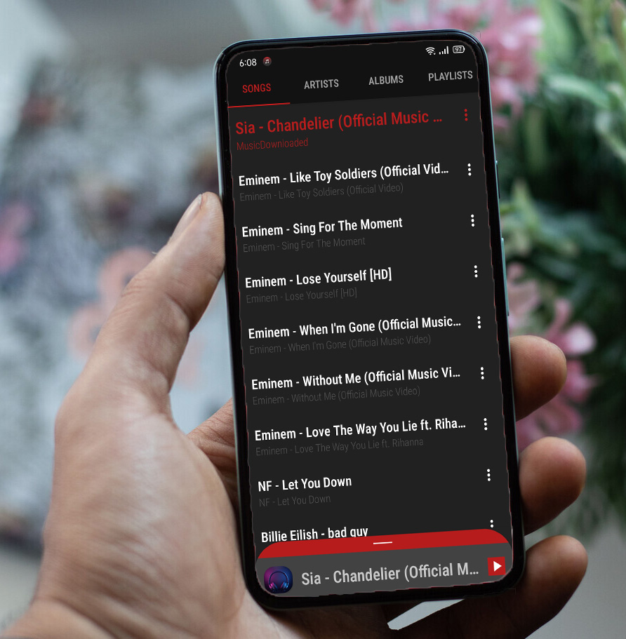
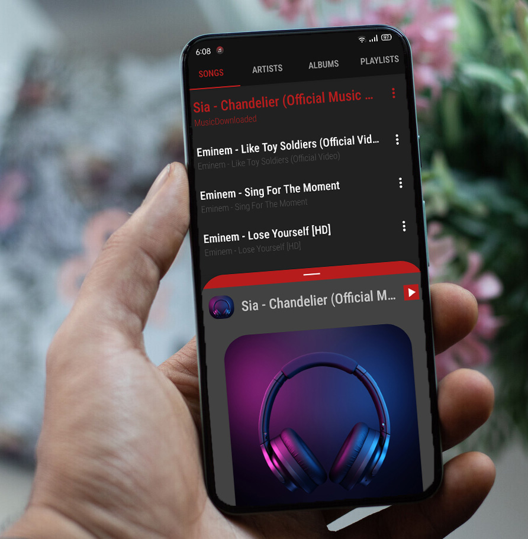
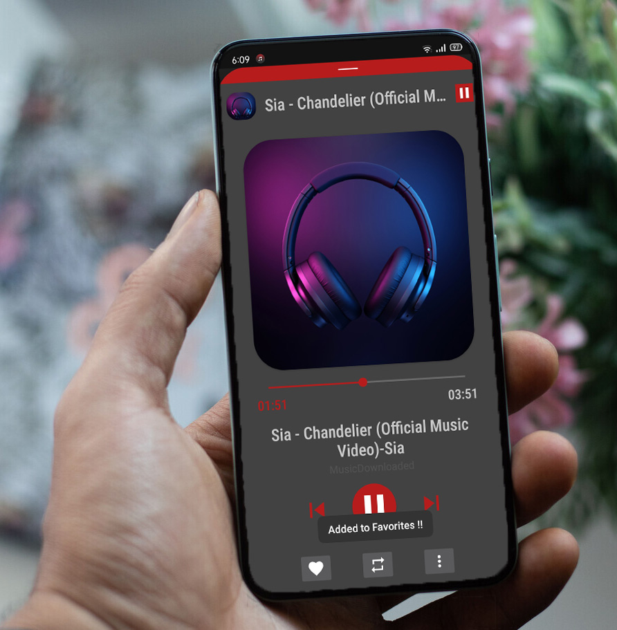
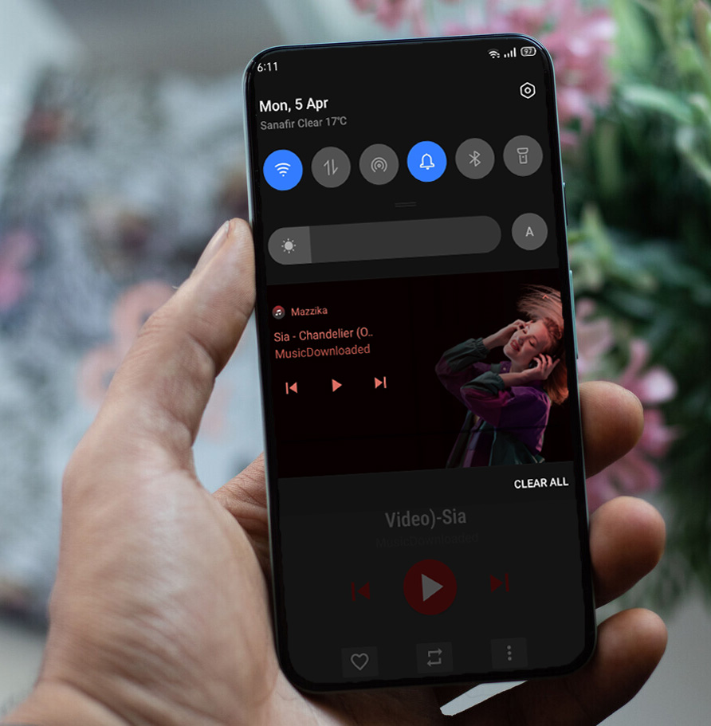

# Mazzika-app

### App Description

<b> Mazzika-app </b> is a media player android application.  
For playing any audio with duration more than 30 seconds.   
With media notification in the status bar and the navigation bar.   
With multiple features like (add song to favourites, delete song, set as a ringtone, etc...). 

***

##### Tools Used
- SQLite
- Receivers
- Notifications
- MVC Model

***

## Screenshots

### Songs Fragment

### Bottom Sheet

### Playback Audio Manager

### Some Features

### Media Notification

